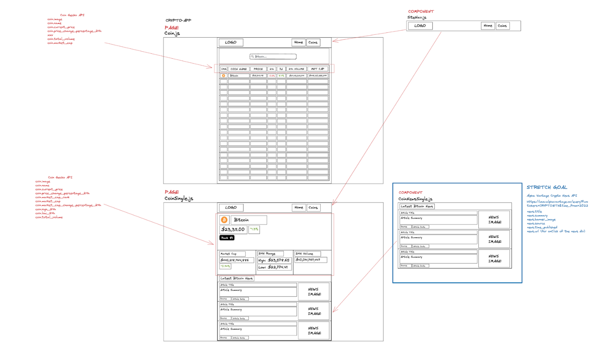
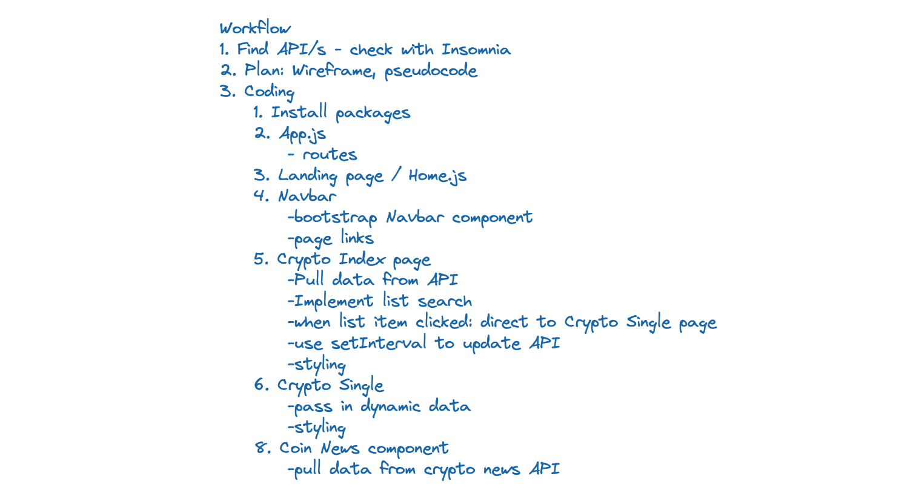
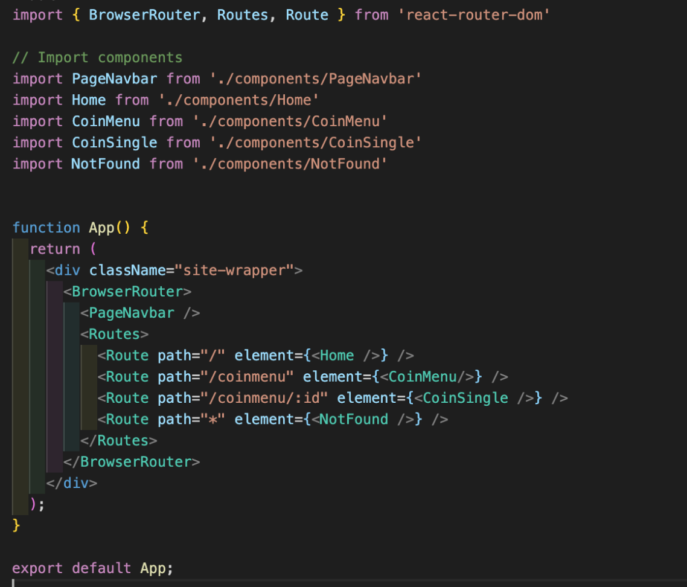
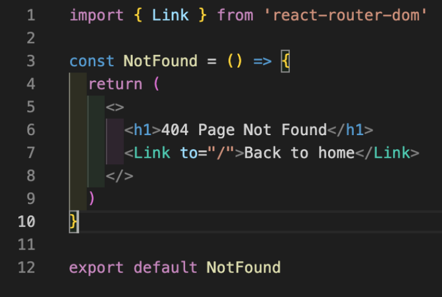
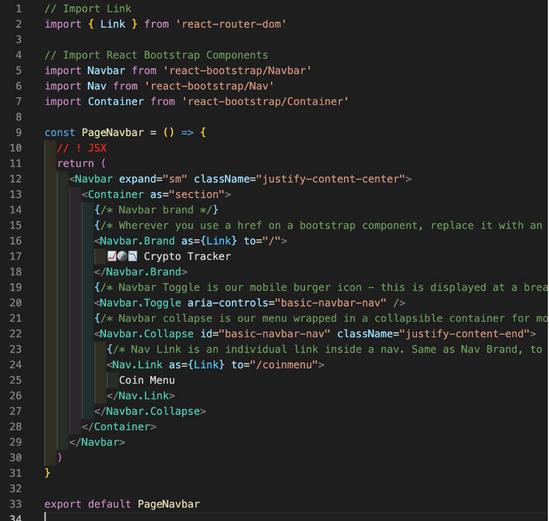
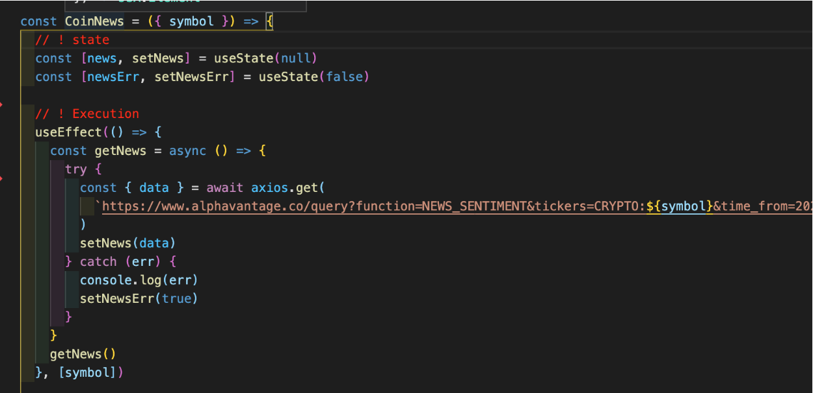
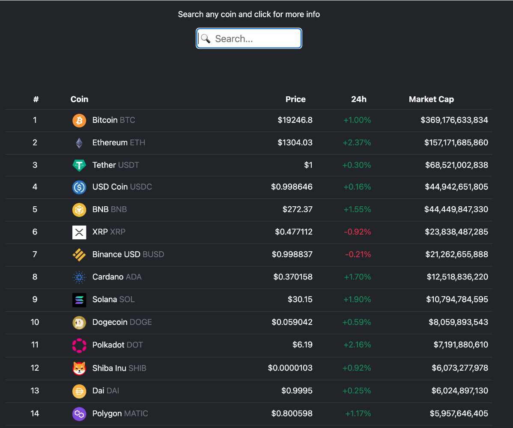
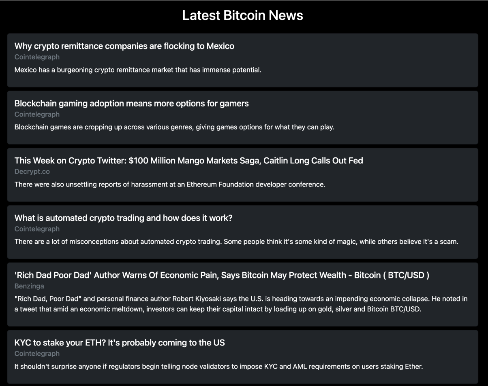

# GA SEI Project 2 - Crypto Price & News Tracker

**Project Link:** https://bit.ly/3CRaMCt

## Overview

This project was completed for the General Assembly Software Engineering Immersive course in fulfilment of the project 2 group API assignment. This project was a big learning experience for me as it was my first group project working collaboratively with other developers. This, coupled with the short timescale of the project meant that we quickly learnt how to work and collaberate effectively in the development of a single project. The finished result of the project was a crypto app that displays price data and news stories for each cryptocurrency coin by pulling data from two separate APIs. On arrival to the app’s landing page the price and other financial data of various cryptocurrencies is immediately visible to users in the form of a list. Users can then use the search bar to find any top 100 cryptocurrencies and will see the list of coins filtered to their search letters/words. Furthermore, a user can click on a cryptocurrency coin row and will be directed to that individual coin page using a dynamic page route. On an individual coin page the user will see a more detailed breakdown of financial data for that coin and also the most recent news articles for that crypto coin.

**Timeframe:** 36hrs | Group

**Other Developers:**

- Mark repo: https://github.com/markmuy40/SEI-65-Project-2
- Aaron repo: https://github.com/Zahlsky/SEI-65-Project-2

## Tech used:

- **Frontend:** HTML CSS, JavaScript, React, SASS, React Bootstrap, React Router
- **APIs:** CoinGecko API V3, Alpha Vantage Market News (Crypto) API
- **Deployment:** Netlify

## Planning process

This project was the first time I used both React and APIs outside of the course classes and also the first time collaborating with other developers on a project. To collaborate we used slack for our comms and a combination of zoom and VSCode Liveshare for pair coding sessions. As this was a new experience for the group it was important that we had a clear plan of what we needed to do and who needed to do what. To this end, after we settled on using a cryptocurrency price API from CoinGecko we began to draw up a wireframe for the project using Excalidraw where all three group members could view, edit or add to the wireframe - the project wireframes are displayed below.

The wireframe is displayed in the image below and shows a main page which lists all of the top 100 cryptocurrencies for which financial data is pulled from the third-party CoinGeck API. The data displayed on this main page includes the cryptocurrency names, ticker symbols, market capitalisation, current price and 24h price change. On this main page users can use a form input at the top of the list to search for their favourite crypto by name and the list will be filtered based on the conditions of their search. Users can click on any of the cryptocurrencies in the list and will be directed to the single coin pages which display further financial information for the clicked coin along with a feed of recently published news articles that are specific to that single coin. This coin-specific news data is pulled dynamically using the coins ticker symbol from another third-party API and mapped onto the single coin pages.

While Aaron and Mark were finalising the wireframe, I started to write a project workflow to establish the order in which tasks needed to be completed and who would be completing them - this is displayed below. After establishing the project idea and finding and testing the APIs we would begin pseudocoding the individual components of our project. It can be quite daunting when faced with a blank code file and it can be difficult to know exactly where to start. However, if you first write out your code logic in English it can really help comprehend the exact problem you're trying to solve.

## Coding Process

After writing the pseudocode, I began to code the App.js file which involved creating a BrowserRouter component to which I added a PageNavbar which will be displayed on every page route of the website. I then added a Routes component and created the page routes for the crypto app which included the Landing page, the CoinMenu page, the dynamic CoinSingle page and a NotFound page. Each of these routes will direct to the relevant page, other than the CoinSingle page which has a dynamic route based on the id of the cryptocurrency. Each of these pages is imported to App.js as a component and added to a Route element. This is displayed in the code snippet below.

After this I started to work on the components and pages that I had been tasked with which saw me start coding on the NotFound page which renders when a user tries to reach a route path which has not been created. This page did not need much detail, therefore I only added a single h1 element stating “404 Page Not Found” and also a clickable link to return the user back to the home page. To add the Link element it had to be imported from the react-router-dom package. The logic for this page is displayed below.

Following the completion of this page, I wrote the code for the site navigation bar which is in the form of a component as it is reused across the website on multiple pages. Due to the time constraints on this project the navigation bar was coded using react bootstrap which allowed for a pre-built navbar component to be imported and used which meant the component had links to the site pages, a clickable brand icon, and was responsive to screen size. The bootstrap components used in this navbar had to be imported from the package along with the Link element which allowed the ‘Coin Menu’ item in the navbar to be a clickable link to redirect users to the Coin Menu page.

After the group was making strong progress with the main project tasks, I decided to work on what was initially one of the stretch goals but since work on the main coding tasks was going well we decided as a group that I should begin coding the Coin News component. As I was new to coding on a project with multiple developers and not yet familiar with GitHub branches, I decided to make a clone of the project repo and work on coding the Coin News component in a separate repo in an effort to avoid any conflicts or errors to the main repo while we all coded on the project at the same time. This dynamic worked quite well and allowed me to insert the working component into the main project repo after completion. The Coin News component itself was relatively straightforward and required data to be pulled from the Alpha Vantage Market News (Crypto) API using an endpoint with a dynamic crypto symbol variable which allowed the news data to be retrieved for each coin - this logic is displayed in the code snippet below. After that the data needed to be mapped onto the page in the format that we specified in the wireframe. The news data was returned inside react bootstrap components which meant that styling to an external stylesheet was not required and the imported bootstrap components came with default styling which was altered by adding keywords to the component attributes.

## Who did what?

The project involved group collaboration in most of the components/features built but some tasks we would purposefully work on as a group and sometimes we would break off and work on something individually. The initial setup of the project repo, creating the file layout and installing packages that we would use on the project was done as a group. This was important to do collaboratively as it would help us later on in development if we all knew the file structure very well.

As for the individual tasks, to my knowledge Aaron worked on developing the coin single page which was a big job involving mapping all the coin data from the API, and he was also responsible for much of the project styling which was done in SASS. Further, Mark worked on the landing page and the Coin Index page (CoinMenu.js) which involved mapping the coin data for the API and implementing search functionality to filter the pulled cryptocurrency coins based on their names. This was a mammoth task which Mark executed incredibly well. The logic for the parts of the project developed by Aaron and Mark is not talked about in detail in this ReadMe but if you are interested in the pages they worked on I would suggest taking a look a their project ReadMes which are linked at the top of the page.

As for myself, I initially worked on setting up the App.js page to establish page routing, then I worked on some of the main components which was the navbar and the 404/not found page. After completing these tasks relatively quickly I worked on the Coin News feature which was initially a stretch goal in our planning but based on our progress we decided that I could work on it individually. This method of development turned out quite well and after resolving some minor bugs with the API along the way I managed to get the feature working to dynamically pull and map coin-specific news data onto a page. At this stage it was just a case of manually merging this Coin News feature back into the main project without causing any major bugs which we managed to as a team.

## Project Screenshots

Displayed below are two screenshots from the project. The first showing the main Coin Menu page which displays all of the 100 cryptocurrency coins and the search bar at the top of the page. The second screenshot displays the cryptocurrency news feed which displays the latest news articles specific to the individual coin that has been clicked. This screenshot displays the output for the code logic for the Coin News feature which is explained and displayed in the code snippet previously.

## Project Wins

- I was able to add code to the attributes of an element that contained 24hr price change data so that it could be styled as green or red based on whether its value was either positive or negative by using ternary operator. This was only a simple piece of logic but the impact that it had on the site appearance was significant and made the site look more dynamic. Further, a similar piece of javascript logic was added to the element to display a “+” or “-” when the number was such.
- All came together with clear lines of communication throughout. Mark set up Google Meets so that we could work outside of course which went very well. Furthermore, we also managed to collaborate with VSCode Liveshare effectively for the first time and found this method to be a great way to solve bugs in our code.

## Challenges / Bugs

- I had some initial difficulty mapping in and returning the data from the Alpha Vantage Market News (Crypto) API but after consulting the documentation I discovered there was an error in my API key which was easily rectified.
- Deployment using Netlify was not unfortunately not without problems and took a little longer than it probably should. Though, this was certainly down to my own error in understanding as I was trying to deploy before using ‘npm run build’ and wasn’t selecting the correct directory to deploy. This was a simple mistake but one that I will likely not forget and I’m pleased to say that Netlify is now working very smoothly with this and my other projects.

## What did I learn?

- Identifying, targeting and returning complex data from multiple APIs dynamically was quite challenging at first but after we overcame the initial bugs it was a key learning from the project.
- Worked together to get the wireframe setup with components connected, UseState setup and ensuring endpoints were in place for each route.
- As we were a group of three we had to think about the way in which we would collaborate on the project. This was quite a learning experience having previously only worked on solo projects. We first decided to assign each group member with their own tasks for building separate components, pages or individual bits of logic. We used Live Share within VS Code while on video call to work collaboratively on some parts of the project. Conversely, some tasks such as coding the CoinNews component were coded in isolation to prevent errors to the main repo and then merged into the main when completed.

## Future Improvements

- Redo the design and colour scheme for the project to make the styling more uniform. Due to the short time span for this project we didn’t manage to work too much on styling and instead focused on the React logic and did basic styling with React Bootstrap.
- Another simple upgrade to the project would be to add a button that changes the UI between a light/dark theme when clicked. This would allow the user to set the colour of the UI based on their own preference. This would be a relatively simple task as this feature would be created using fairly common logic but it would help to add more substance to the project.
- Perhaps a more advanced improvement could be to add a user watchlist feature. This would allow users to track their favourite cryptocurrencies by adding them to a watchlist. This would be fairly complex and would require a backend system to be set up which would include a database to store user details for authentication along with individual user’s watchlist data.
